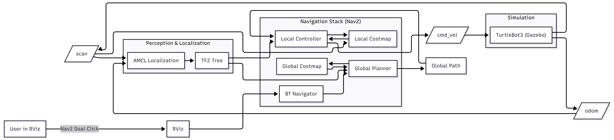
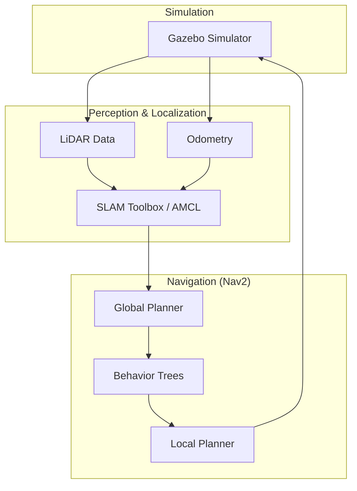
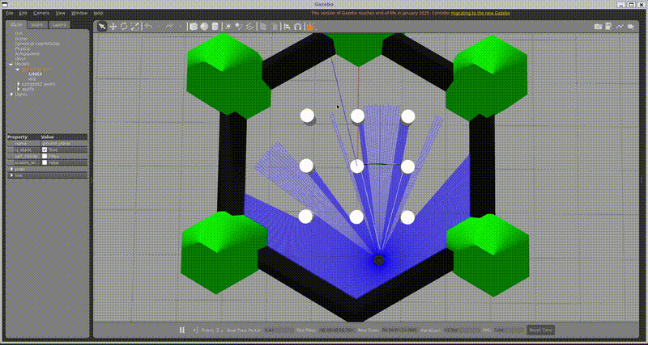
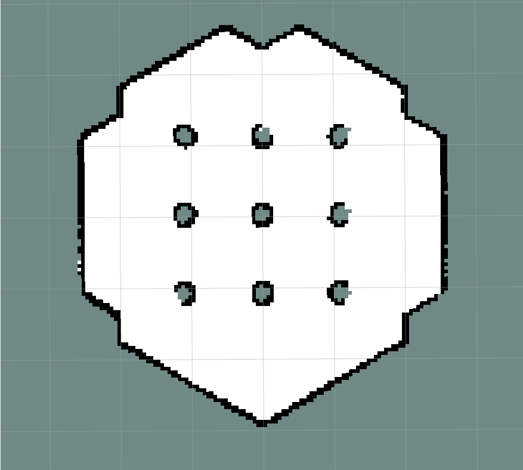

# Building an Autonomous Mobile Robot with ROS2 & Nav2



## 🚀 Overview
An end-to-end autonomous navigation stack implemented on a **TurtleBot3 Waffle** in **Gazebo**, leveraging **ROS2 Humble** and **Nav2**. This project demonstrates a complete robotics pipeline: from SLAM and localization to real-time path planning and obstacle avoidance.

**Elevator Pitch:**
A production-ready ROS2 implementation that enables a mobile robot to autonomously map its environment and navigate to user-defined goals with high precision. By integrating SLAM Toolbox and the Nav2 stack, this project showcases a robust solution for autonomous warehouse or service robotics applications.

---

## 🏗️ System Architecture
The system is built on a modular architecture, separating perception, localization, and navigation.



Detailed architecture can be found in [docs/system-architecture.md](docs/system-architecture.md).

---

## 🛣️ Navigation Pipeline
The autonomous navigation follows a structured command-to-motion flow:

1. **RViz Goal**: User selects a destination via the graphical interface.
2. **Planner**: Computes a collision-free **Global Path** using global costmaps.
3. **Local Planner**: Generates real-time velocity commands (`cmd_vel`) to follow the global path while avoiding dynamic obstacles.
4. **Controller**: Executes motion through the robot's actuators in Gazebo.

For a detailed walkthrough, see [docs/navigation-flow.md](docs/navigation-flow.md).

---

## 🛠️ System Components
- **Gazebo**: High-fidelity 3D simulation environment.
- **Nav2**: The industry-standard navigation framework for ROS2.
- **AMCL**: Adaptive Monte Carlo Localization for robust robot tracking.
- **Costmaps**: Multi-layered maps (Global/Local) representing obstacle data.
- **TF2**: Transformation library managing coordinate frames (`map`, `odom`, `base_link`).
- **SLAM Toolbox**: Synchronous and asynchronous mapping and localization.

---

## 🏁 Getting Started

### Day 1: Robot Bring-up
1.  **Launch Gazebo World**:
    ```bash
    ros2 launch turtlebot3_gazebo turtlebot3_world.launch.py
    ```
2.  **Verify Sensors**: Check `/scan` and `/odom` topics in RViz.

### Day 2: Autonomy
1.  **Launch Navigation**:
    ```bash
    ros2 launch turtlebot3_navigation2 navigation2.launch.py use_sim_time:=True map:=path/to/your/map.yaml
    ```
2.  **Autonomous Drive**: Use the "2D Nav Goal" tool in RViz to set a destination.

---

## 📺 Demo

*Clicking a point in RViz triggers autonomous path planning and execution.*

**Video**: https://drive.google.com/file/d/15k39QlmxjkoDRNi8egDS7I8tnDRK4YeL/view?usp=drive_link

---

## 🗺️ Mapping & Visualization

### SLAM Results

*Environment mapped using SLAM Toolbox.*

### RViz Goal Setting

*Real-time path generation in RViz.*

---

## 🔍 ROS2 Internal Inspection

### Node Graph
The node graph demonstrates the decoupled nature of the system, with clear communication channels between the sensor drivers, the localization nodes, and the Nav2 controllers.

### Topics Verification
| Topic | Type | Description |
| :--- | :--- | :--- |
| `/cmd_vel` | `geometry_msgs/msg/Twist` | Velocity commands to the robot. |
| `/scan` | `sensor_msgs/msg/LaserScan` | LiDAR point data for mapping/avoidance. |
| `/odom` | `nav_msgs/msg/Odometry` | Estimated robot position and orientation. |
| `/goal_pose` | `geometry_msgs/msg/PoseStamped` | The target destination from RViz. |

---

## 📂 Repository Structure
```text
.
├── docs/                   # Detailed technical documentation
├── media/                  # Images, GIFs, and videos
│   ├── demo/               # Navigation demos
│   └── map/                # Generated occupancy grids
├── Dockerfile              # Containerization for reproduction
├── docker-compose.yml      # Orchestration for Gazebo/Nav2
├── requirements.md         # System dependencies
├── setup.sh                # Environment configuration
└── README.md               # Project overview
```

---

## ⚙️ Installation & Setup (WSL2)

### Prerequisites
- Windows 11 with WSL2 (Ubuntu 22.04)
- [ROS2 Humble Desktop](https://docs.ros.org/en/humble/Installation.html)
- [TurtleBot3 Packages](https://emanual.robotis.com/docs/en/platform/turtlebot3/quick-start/#pc-setup)

### Step-by-Step
1.  **Clone the Repository**:
    ```bash
    git clone https://github.com/yourusername/ros2-autonomous-nav.git
    cd ros2-autonomous-nav
    ```
2.  **Configure Environment**:
    ```bash
    chmod +x setup.sh
    ./setup.sh
    ```
3.  **Install Dependencies**:
    Refer to [requirements.md](requirements.md) for the full list of `apt` packages.

---

## ❓ Troubleshooting
- **No Map in RViz**: Ensure `use_sim_time:=True` is set when running in Gazebo.
- **Robot Not Moving**: Check if `TURTLEBOT3_MODEL` is exported (default: `waffle`).
- **GPU Issues in WSL2**: If Gazebo crashes, ensure `export LIBGL_ALWAYS_SOFTWARE=1` is in your `.bashrc` or `setup.sh`.

---

## 📈 Future Improvements
- [ ] Integration of **Deep Reinforcement Learning** for local obstacle avoidance.
- [ ] Multi-robot coordination using **Nav2 Simple Commander**.
- [ ] Implementation of **Visual SLAM** (using depth cameras).

---

## 💼 Why This Project Matters
Autonomous navigation is the cornerstone of modern robotics, from Last-Mile Delivery to Autonomous Mobile Robots (AMRs) in smart factories. This project demonstrates proficiency in the standard ROS2 stack, containerization (Docker), and systems integration—skills directly applicable to the autonomous vehicle and industrial automation sectors.

---

## 🔗 Connect with Me
- **LinkedIn**: https://www.linkedin.com/in/mohit-pawar-8883361a6/
- **Email**: mohitpawar0404@gmail.com

---
*Developed by Mohit Pawar - Focused on Building the Future of Robotics.*
