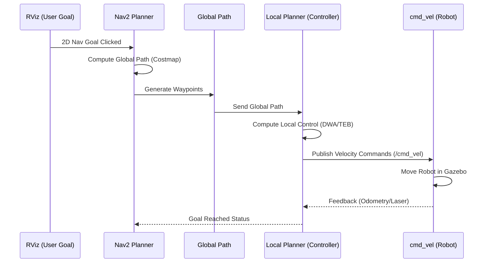

# Navigation Flow

This document describes the flow of information when a goal is set in RViz.

## Pipeline Steps

1. **RViz Goal**: User clicks a point in RViz using the "2D Nav Goal" tool.
2. **Planner**: Nav2 receives the goal and uses the Global Planner to find the shortest path on the global costmap.
3. **Global Path**: A set of waypoints is generated from the current position to the goal.
4. **Local Planner**: The Controller (Local Planner) takes the global path and generates velocity commands, considering the local costmap for dynamic obstacle avoidance.
5. **Controller**: Translates the path into `cmd_vel` (linear and angular velocities).
6. **cmd_vel**: The robot receives these commands and moves in the simulation.
7. **Robot Motion**: The resulting motion is reflected in the simulation, and sensors provide feedback to close the loop.
