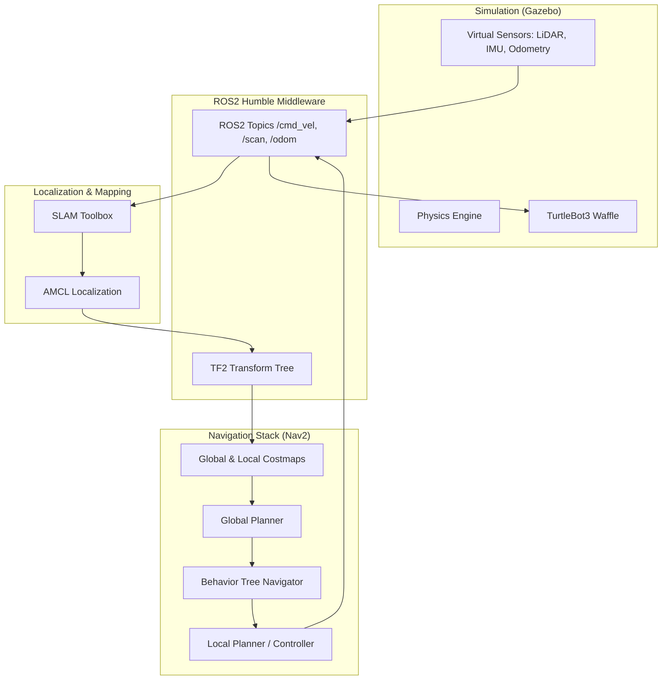

# System Architecture

The following diagram illustrates the high-level system architecture of the autonomous mobile robot.

## Components Explanation

- **Gazebo**: Provides the simulated environment and robot physics.
- **Nav2**: The brain of the navigation system, handling path planning and obstacle avoidance.
- **SLAM Toolbox**: Used for creating the map of the environment.
- **AMCL**: Uses Particle Filter to localize the robot within a known map.
- **TF2**: Manages the coordinate transformations between different frames (e.g., `map` -> `odom` -> `base_link`).
